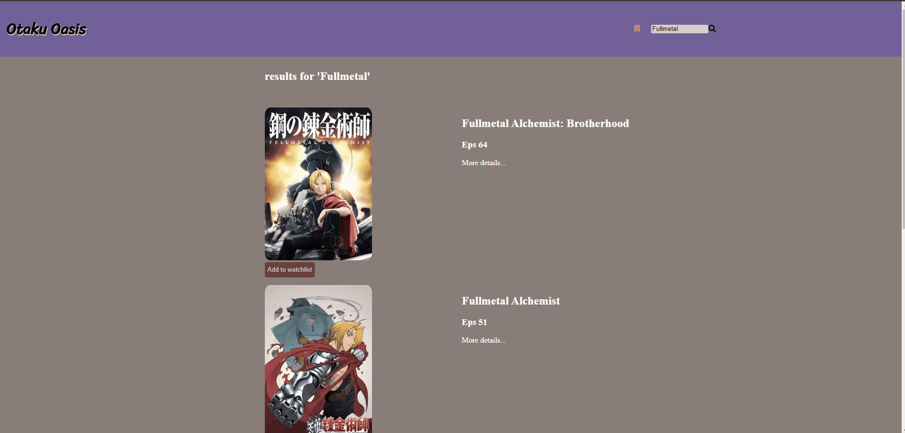

### Otaku Oasis

Application that allows users to search for their favorite anime shows or movies and add them to a watchlist.

## Why I built this

As a fan of anime and I wanted an easy way people to keep track of the anime they want to watch.

## Technologies Used

- Typescript
- HTML5
- CSS3
- [Jikan](https://docs.api.jikan.moe/)

## Live site

Try the live site [OtakuOasis](https://jeffreymejia.github.io/Otaku-Oasis/)

## Features

-User can search for anime
-User can view individual anime details
-User can add and delete anime to their watchlist

## Preview

